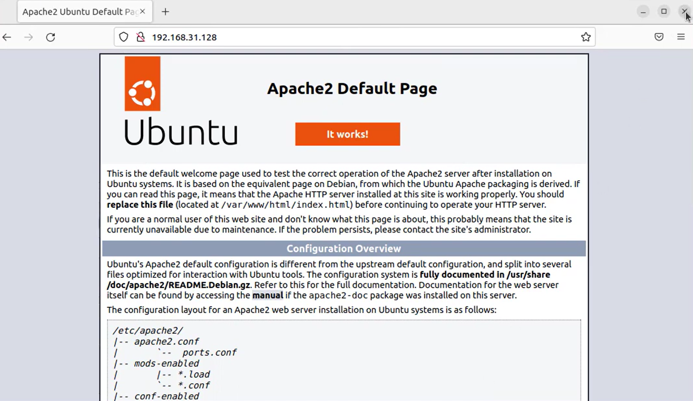

# lamp-stack-setup

## 1. Initially i begin with system update

- Ensuring system is up to date

```bash
sudo apt update && sudo apt upgrade -y
```
## 2. Installed the Apache servers
```bash
sudo apt install -y apache2 -y
```
- Checking the apache status, ensuring its running
```bash
sudo systemctl status apache2
```
## 3. Installed MariaDB for databse management
```bash
sudo apt install mysql-server -y
```
- Ensuring a secured root password is properly configured
```bash
sudo mysql_secure_installation
```

## 4. PHP installation with Apache connection
```
sudo apt install php libapache2-mod-php php-mysql -y
```
- I have created a PHP file named Info.php
- add some PHP code content
- Navigating to the this URL on browser the content seems visible

# Configuration and testing
## 1. Entered the shell of MariaDb using
```
sudo mysql -u root -p
```
## 2. I created a database using
```
CREATE DATABASE sample_db;
USE sample_db;
CREATE TABLE users (
    id INT AUTO_INCREMENT PRIMARY KEY,
    name VARCHAR(100),
    email VARCHAR(100)
);
```
## 3. Added sample data
```
INSERT INTO users (name, email) VALUES ('John salim', 'john@example.com');
INSERT INTO users (name, email) VALUES ('Jane Manyai', 'jane@example.com');
```


# screenshots

